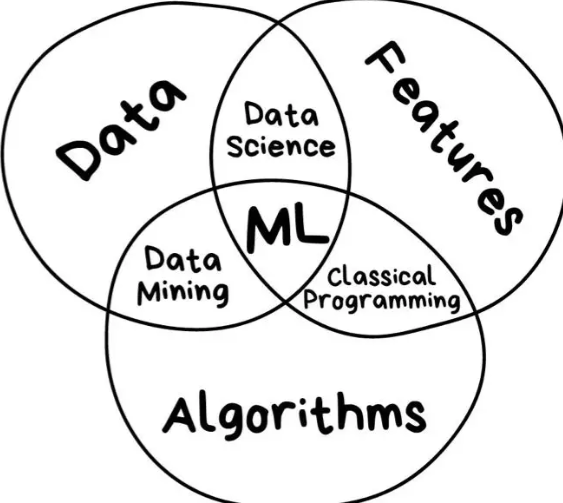

# 什么是机器学习？

   * [什么是机器学习？](#什么是机器学习)
      * [范围](#范围)
      * [场景](#场景)
      * [vs](#vs)
         * [vs 人类思维](#vs-人类思维)
         * [vs DL](#vs-dl)
         * [vs AI](#vs-ai)
         * [vs 模式识别](#vs-模式识别)
         * [vs 数据挖掘](#vs-数据挖掘)
         * [vs 统计学习](#vs-统计学习)
         * [计算机视觉](#计算机视觉)
         * [语音识别](#语音识别)
         * [自然语言处理](#自然语言处理)

一种实现人工智能的方法

一门多领域交叉学科，涉及概率论、统计学、逼近论、凸分析、算法复杂度理论等。
关注的问题是计算机程序如何随着经验积累自动提高性能，
它专门研究计算机怎样模拟或实现人类的学习行为，以获取新的知识或技能，重新组织已有的知识结构使之不断改善自身的性能。
或者简单的说，机器学习就是把无序的数据转化成有用的信息。

机器学习是人工智能的核心，是使计算机具有智能的根本途径，
它的应用已遍及人工智能的各个分支，如专家系统、自动推理、自然语言理解、模式识别、计算机视觉、智能机器人等领域。
其中典型的是专家系统中知识获取的瓶颈问题，人们一直在努力试图采用机器学习的方法加以克服或改进。

是一种让计算机利用数据而不是指令来进行各种工作的方法。
“统计”思想将在你学习“机器学习”相关理念时无时无刻不伴随。
相关而不是因果的概念将是支撑机器学习能够工作的核心概念。会颠覆对你以前所有程序中建立的因果无处不在的根本理念。
机器学习方法是计算机利用已有的数据(经验)，得出了某种模型(迟到的规律)，并利用此模型预测未来(是否迟到)的一种方法。
机器学习的一个主要目的就是把人类思考归纳经验的过程，转化为计算机通过对数据的处理计算得出模型的过程。
经过计算机得出的模型能够以近似于人的方式解决很多灵活复杂的问题。

从广义上来说，机器学习是一种能够赋予机器学习的能力，以此让它完成直接编程无法完成的功能的方法。
从实践的意义上来说，机器学习是一种通过利用数据，训练出模型，然后使用模型预测的一种方法。

父类 人工智能
子类 深度学习

## 范围
从范围上来说，机器学习跟模式识别，统计学习，数据挖掘是类似的
同时，机器学习与其他领域的处理技术的结合，
	形成了计算机视觉、语音识别、自然语言处理等交叉学科。
因此，一般说数据挖掘时，可以等同于说机器学习。
同时，我们平常所说的机器学习应用，应该是通用的，
	不仅仅局限在结构化数据，还有图像，音频等应用。
机器学习所牵扯的一些相关范围的学科与研究领域

## 场景
* “等人问题”
第一种方法是采用知识
	搜寻能够解决这个问题的知识。可能找不到已有的知识能够解决这个问题。
第二种方法是问他人
	去询问他人获得解决这个问题的能力这个问题没有人能够解答
第三种方法是准则法
	问自己的内心，我有否设立过什么准则去面对这个问题？如，无论别人如何，我都会守时到达。
经验法
	利用了以往所有相约的数据，依据数据所做的判断跟机器学习的思想根本上是一致的。

## vs

### vs 人类思维
人类在成长、生活过程中积累了很多的历史与经验
	人类定期地对这些经验进行“归纳”，获得了生活的“规律”
	人类使用这些“规律”，对未知问题与未来进行“推测”，从而指导自己的生活和工作。
机器学习中的“训练”与“预测”过程
	可以对应到人类的“归纳”和“推测”过程
	机器学习的思想并不复杂，仅仅是对人类在生活中学习成长的一个模拟
	由于机器学习不是基于编程形成的结果
		因此它的处理过程不是因果的逻辑，而是通过归纳思想得出的相关性结论。
“历史往往不一样，但历史总是惊人的相似”
	通过学习历史，我们从历史中归纳出人生与国家的规律
		从而指导我们的下一步工作，这是具有莫大价值的。
	当代一些人忽视了历史的本来价值
		而是把其作为一种宣扬功绩的手段，这其实是对历史真实价值的一种误用。

### vs DL
是采用机器学习，从样本中进行识别（如：图像识别）的一组技术
	该系统主要识别物体的边缘、结构、类型以及对象本身
深度学习不能完全等同于诸如 Deep Q-Learning（DQN）的
	深层强化神经网络（Deep Neural Networks）

### vs AI

AI是一个广义的概念
	它是一门让机器变得聪明的科学
		换言之，让机器（如：视觉识别、自然语言处理等）替人类处理各项任务
	AI 并不完全是机器学习或全面智能
		它可能只是一段基本程序，被安装在扫地机器人上，用于判断墙角距离
ML是将 AI 运用到系统中，实现从经验中学习的一种（或一组）方法
	其目标不仅是复制人类的行为
		还旨在减少花费在诸如预测股票价格之类，繁简不同的任务上的时间和精力。
机器学习通过使用样本和基于数据
	而不是靠编程或算法，来识别模型并做出决策

### vs 模式识别
模式识别 = 机器学习
	两者的主要区别在于前者是从工业界发展起来的概念，后者则主要源自计算机学科。

### vs 数据挖掘
数据挖掘 = 机器学习 + 数据库
数据挖掘仅仅是一种思考方式
	告诉我们应该尝试从数据中挖掘出知识，但不是每个数据都能挖掘出金子的，所以不要神话它。
一个拥有数据挖掘思维的人员才是关键
	而且他还必须对数据有深刻的认识，这样才可能从数据中导出模式指引业务的改善。
大部分数据挖掘中的算法是机器学习的算法在数据库中的优化

### vs 统计学习

统计学习近似等于机器学习
	统计学习是个与机器学习高度重叠的学科
因为机器学习中的大多数方法来自统计学
	甚至可以认为，统计学的发展促进机器学习的繁荣昌盛
		例如著名的支持向量机算法，就是源自统计学科。
但是在某种程度上两者是有分别的
	统计学习者重点关注的是统计模型的发展与优化，偏数学
	ML学习者更关注的是能够解决问题，偏实践
		因此机器学习研究者会重点研究学习算法在计算机上执行的效率与准确性的提升。

### 计算机视觉

计算机视觉 = 图像处理 + 机器学习
图像处理技术用于将图像处理为适合进入机器学习模型中的输入
	机器学习则负责从图像中识别出相关的模式。
计算机视觉相关的应用非常的多
	例如百度识图、手写字符识别、车牌识别等等应用

### 语音识别

语音识别 = 语音处理 + 机器学习
音识别就是音频处理技术与机器学习的结合
语音识别技术一般不会单独使用
	一般会结合自然语言处理的相关技术
目前的相关应用有苹果的语音助手siri等

### 自然语言处理
自然语言处理 = 文本处理 + 机器学习
自然语言处理技术主要是让机器理解人类的语言的一门领域。
在自然语言处理技术中
	大量使用了编译原理相关的技术，例如词法分析，语法分析等等
	除此之外，在理解这个层面，则使用了语义理解，机器学习等技术。

