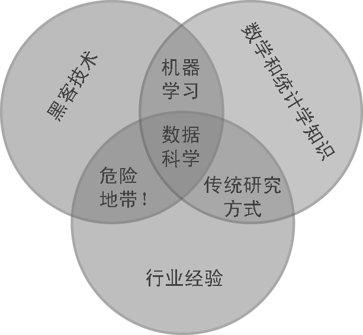
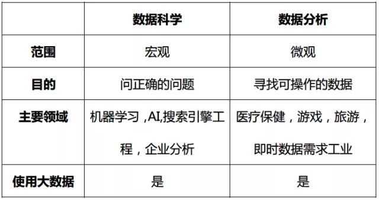

# 什么是数据科学？

数据科学是一个多学科领域，专注于从大量原始和结构化数据中找到切实可行的见解。  
该领域主要注重发掘我们没有意识到我们还不清楚的事情的答案。  
数据科学专家使用几种不同的技术来获得答案，包括计算机科学，预测分析，统计学和机器学习，  
通过海量数据集进行解析，努力为尚未被认识到的问题提供解决方案。  

数据科学家的主要目标是找出问题并找出潜在的研究途径，而不用担心具体的答案，更多的重点放在寻找正确的问题上。  
专家通过预测潜在趋势，探索不同和不相关的数据来源，并找到更好的分析信息的方式来实现这一点。  

  

## vs 统计学

分析思维是数据科学的核心思维方式，而分析思维就是关于计算与统计的思维。

## vs 数据分析

* 主要区别在于范围  

数据科学是一个涵盖性术语，包含了一些可用于挖掘大型数据集的领域。  
数据分析是它更加集中的版本，甚至可以被视为更大的过程的一部分。  
而分析，则是致力于去实现那些根据现有查询词组能够立即被应用的可执行的建议见解。  

* 两个领域的另一个显著差异是探索问题

数据科学并不关心怎么去回答特定的查询，而是通过海量的数据集进行解析，有时采用非结构化的方式来揭示一些想法。  
数据分析则在重点突出时效果更好，需要基于现有数据的答案。  
数据科学产生更广泛的见解，集中讨论应该问哪些问题，而大数据分析则强调发现被问问题的答案。  

***更重要的是，数据科学更关心的是提问，而不是找到具体的答案。***
该领域专注于根据现有数据建立潜在的趋势，并实现更好的分析和建模数据的方式。  

  

这两个领域可以被认为是同一枚硬币的两面，他们的功能是高度相互关联的。  
数据科学奠定了重要的基础，并解析了大数据集，来创建可能非常重要的初始观察，未来趋势和潜在见解。  

这些信息本身对于一些领域是有用的，尤其是建模，提高机器学习以及增强AI算法，因为它可以改进信息的分类方式和理解方式。  
然而，数据科学提出了一些我们以前不知道的重要问题，同时提供了很少的答案。  
通过将数据分析添加到组合中，我们可以将那些我们不知道的信息转化为实际应用中的可操作的见解。  

在思考这两个学科时，很重要的一步是要忘记把它们分别视为“数据科学与数据分析”。  
相反，我们应该将它们视为整体的一部分，这对于理解我们拥有的信息，以及如何更好的分析和检查它们至关重要。  

